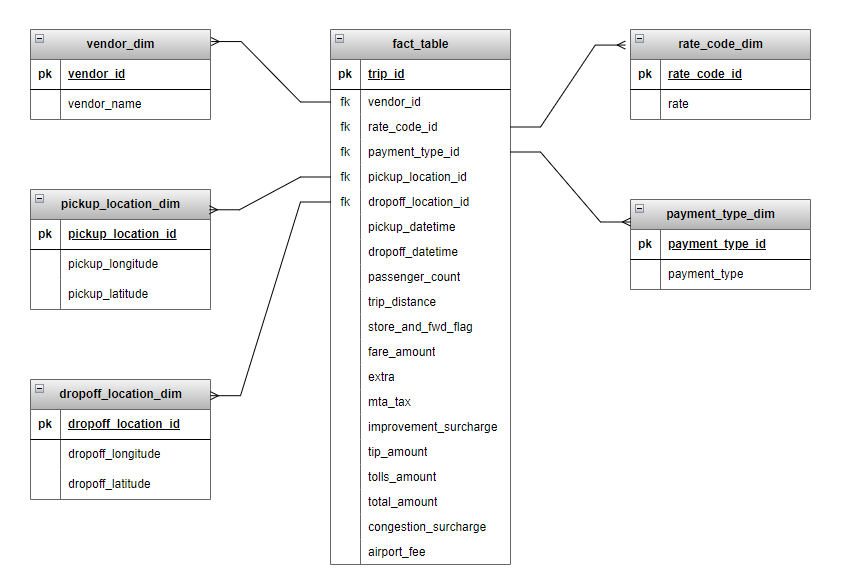

# 🚕 NYC Yellow Taxi Data Engineering Project

## Introduction
The objective of this project is to ingest parquet files to rds tables using two methods:

- Pandas on Jupyter notebook locally
- Aws_s3 extension on RDS Postgres database

## Technologies
- AWS
    - S3
    - RDS (PostgreSQL)

- Language: Python
- DB Tool: DBeaver

## Architecture

## Dataset

From the website:
> Include fields capturing pick-up and drop-off dates/times, pick-up and drop-off locations, trip distances, itemized fares, rate types, payment types, and driver-reported passenger counts. The data used in the attached datasets were collected and provided to the NYC Taxi and Limousine Commission (TLC) by technology providers authorized under the Taxicab & Livery Passenger Enhancement Programs (TPEP/LPEP).

[March 2020 Trip Records (Parquet)](https://d37ci6vzurychx.cloudfront.net/trip-data/yellow_tripdata_2020-03.parquet)
[Taxi Zone Shapefile](https://s3.amazonaws.com/nyc-tlc/misc/taxi_zones.zip)
[Data Dictionary](https://www.nyc.gov/assets/tlc/downloads/pdf/data_dictionary_trip_records_yellow.pdf)

Visit for more information: 
https://www.nyc.gov/site/tlc/about/tlc-trip-record-data.page

## Data Model

## Steps
A. Ingestion using Pandas on Jupyter notebook
1. Data is extracted from the source and saved locally.
2. Convert taxi zone shapefiles to parquet while ensuring that the long and lat values are of the right format.
3. Read the converted taxi zone data and convert to dataframes.
4. Create dimension tables as dataframes.
5. Create dimension tables on DB.
6. Load all dataframes to Postgres on RDS.

B. Ingestion using AWS_S3 extension:
1. Convert the yellow_tripdata.parquet file to csv.
2. Upload the csv file to S3.

3. Access the RDS table on DBeaver.

4. Create a target table for the yellow_tripdata.
5. Install the aws_s3 extension.
6. Create IAM roles for S3 and RDS to setup access for both services.
7. Import the csv file on S3 to the database.

visit the [documentation](https://docs.aws.amazon.com/AmazonRDS/latest/UserGuide/USER_PostgreSQL.S3Import.html) for more info.

